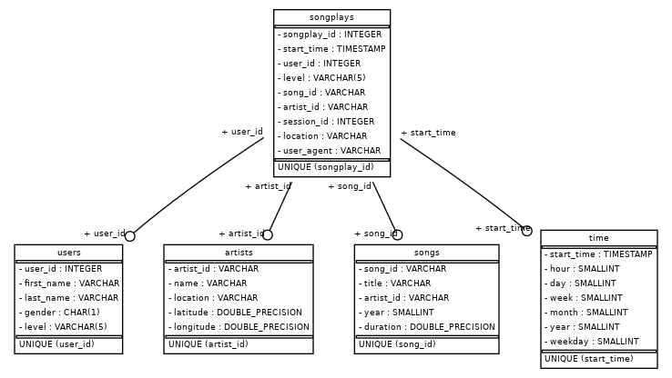

# Project: Data Lake

## Background

A startup called Sparkify wants to analyze the data they've been collecting on songs and user activity on their new
music streaming app. The analytics team is particularly interested in understanding what songs users are listening to.
Currently, they don't have an easy way to query their data, which resides in a directory of JSON logs on user activity
on the app, as well as a directory with JSON metadata on the songs in their app.

---

## Project Description

The startup sparkify want to analyze the behavior of their users on their music streaming app, so they could understand
what songs users are listening to. Therefore in this project, a star schema is chosen, because it is optimized for
querying the user's behaviour.

In this Project an ETL Pipeline is implemented, which extracts the data from S3, processing with pyspark and load the
data back into s3 as a set of dimension tables.

The process of ETL is described in the following steps:

1. Read from the raw data (songs and logs)
2. Transform the `songs` data into `songs` and `artists` tables
3. Filter by `nextSong`-Event only and transform the `log` data into `users` and `time` tables
4. Join the `songs` and `artists` tables with the `users` and `time` tables, so table `songplays` could be generated
5. Save the fact and dimension tables to S3 Data Lake

---

## Project Structure

```
.
├── data
│   ├── log_data : dataset of user activity logs
│   └── song_data : dataset of song metadata
├── dl.cfg : AWS Credentials
├── docker-compose.yml : docker compose file
├── etl.ipynb : notebook to develop ETL pipeline
├── etl.py : script to run the ETL pipeline 
├── README.md : project documentation
├── requirements.txt : list of dependencies need to be installed
```

---

## Project Datasets

There are the S3 links for each:

- Song data: `s3://udacity-dend/song_data`
- Log data: `s3://udacity-dend/log_data`

Log data json path: `s3://udacity-dend/log_json_path.json`

### Song Dataset

The first dataset is a subset of real data from the [Million Song Dataset](https://labrosa.ee.columbia.edu/millionsong/)
. Each file is in JSON format and contains metadata about a song and the artist of that song. The files are partitioned
by the first three letters of each song's track ID. For example, here are filepaths to two files in this dataset.

```
song_data/A/B/C/TRABCEI128F424C983.json
song_data/A/A/B/TRAABJL12903CDCF1A.json
```

And below is an example of what a single song file, TRAABJL12903CDCF1A.json, looks like.

```json
{
  "num_songs": 1,
  "artist_id": "ARJIE2Y1187B994AB7",
  "artist_latitude": null,
  "artist_longitude": null,
  "artist_location": "",
  "artist_name": "Line Renaud",
  "song_id": "SOUPIRU12A6D4FA1E1",
  "title": "Der Kleine Dompfaff",
  "duration": 152.92036,
  "year": 0
}
```

### Log Dataset

The second dataset consists of log files in JSON format generated by
this [event simulator](https://github.com/Interana/eventsim) based on the songs in the dataset above. These simulate app
activity logs from an imaginary music streaming app based on configuration settings.

The log files in the dataset are partitioned by year and month. For example, here are filepaths to two files in this
dataset.

``
log_data/2018/11/2018-11-12-events.json log_data/2018/11/2018-11-13-events.json
``

**Example**

```json
{
  "artist": "Muse",
  "auth": "Logged In",
  "firstName": "Harper",
  "gender": "M",
  "itemInSession": 1,
  "lastName": "Barrett",
  "length": 209.50159,
  "level": "paid",
  "location": "New York-Newark-Jersey City, NY-NJ-PA",
  "method": "PUT",
  "page": "NextSong",
  "registration": 1540685364796,
  "sessionId": 275,
  "song": "Supermassive Black Hole (Twilight Soundtrack Version)",
  "status": 200,
  "ts": 1541721977796,
  "userAgent": "\"Mozilla/5.0 (Windows NT 6.3; WOW64) AppleWebKit/537.36 (KHTML, like Gecko) Chrome/36.0.1985.143 Safari/537.36\"",
  "userId": "42"
}
```

---

## Star Schema (Data Catalog)

The star schema is chosen because it is optimized for querying the user's behaviour. The dimensions and fact table is
saved in a datalake on S3 with a `parquet` format.

The goal to be achieved with the star schema is to optimize queries on song play analysis.

Following is the ERD of the star schema:


### Fact Table

#### songplays table

This tables contains the song play events in the log data.

| Column Name | Type      | Example                            |
|-------------|-----------|------------------------------------|
| songplay_id | long      | 1210                               |
| start_time  | timestamp | 2018-11-21 21:56:47.796000         |
| user_id     | integer   | 15                                 |
| level       | string    | paid                               |
| song_id     | string    | SOZCTXZ12AB0182364                 |
| artist_id   | string    | AR5KOSW1187FB35FF4                 |
| session_id  | long      | 818                                |
| location    | string    | Chicago-Naperville-Elgin, IL-IN-WI |
| user_agent  | string    | "Mozilla/5.0 (X11; .."             |
| year        | integer    | 2018                               |
| month       | integer    | 11                                 |

---

### Dimension Table

#### songs table

This table contains the songs from the music dataset.

| Column Name | Type    | Example              |
|-------------|---------|----------------------|
| song_id     | string  | SOGVQGJ12AB017F169   |
| title       | string  | Ten Tonne            |
| artist_id   | string  | AR62SOJ1187FB47BB5   |
| year        | integer | 2005                 |
| duration    | double  | 337.68444            |

---

#### artist table

This tables contains the artist from music dataset.

| Column Name | Type   | Example            |
|-------------|--------|--------------------|
| artist_id   | string | AR0IAWL1187B9A96D0 |
| name        | string | Danilo Perez       |
| location    | string | Panama             |
| latitude    | FLOAT  | 8.4177             |
| longitude   | FLOAT  | -80.11278          |

---

#### users table

This tables contains the user from sparkify

| Column Name | Type   | Example |
|-------------|--------|---------|
| user_id     | string | 10      |
| first_name  | string | Sylvie  |
| last_name   | string | Cruz    |
| gender      | string | F       |
| level       | string | free    |

---

#### time table

This tables contains timestamps of records in **songplays** broken down into specific units.

| Column Name | Type      | Example                      |
|-------------|-----------|------------------------------|
| start_time  | timestamp | 2018-11-17 00:02:24.796000   |
| hour        | integer   | 0                            |
| day         | integer  | 17                           |
| week        | integer  | 46                           |
| month       | integer  | 11                           |
| year        | integer  | 2018                         |
| weekday     | integer  | 5                            |

---

## Run the project
Make sure to fill out `dl.cfg` with your AWS credentials.

Run the `etl.py` 
```
python etl.py 
```
